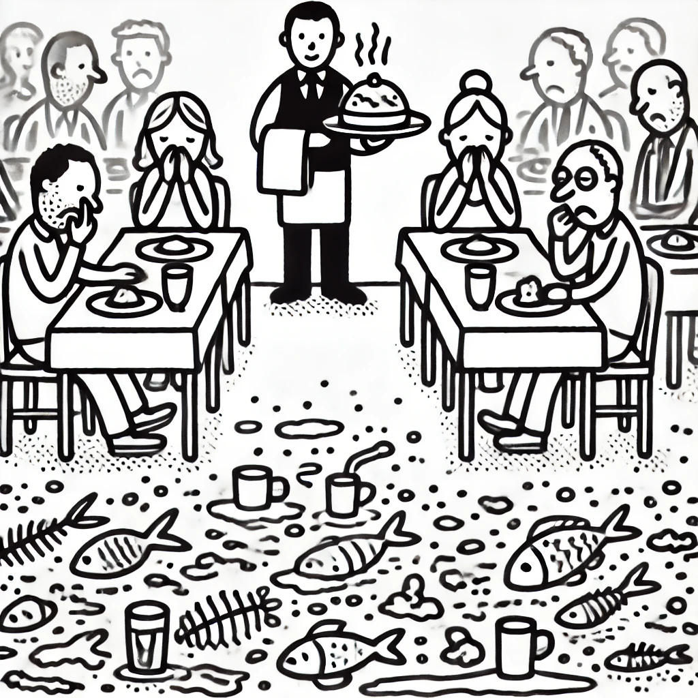

## Effect Oriented Programming

#### James Ward
*Developer Advocate @ AWS* <a href="https://twitter.com/_JamesWard?ref_src=twsrc%5Etfw" class="twitter-follow-button" data-size="large">@_JamesWard</a>

#### Bruce Eckel
*Author/Consultant* <a href="https://www.mindviewllc.com/">MindView LLC</a> <a href="https://twitter.com/BruceEckel" class="twitter-follow-button" data-size="large">@BruceEckel</a>

#### Bill Frasure
*Developer*

---

    

(From a Rory Sutherland TED talk)

---

    

- Food Rating: 8.5/10

---

    

- Food Rating: 8.5/10
- Restaurant goal: 9/10

---

What Problem are we Solving?

---

Building Blocks => Composability

---

<pre style="font-size: 150px; text-align: center;">
f(g(h()))
</pre>

---

A sentence is composed of words.

---

  A&nbsp;sentence&nbsp;is&nbsp;composed&nbsp;of&nbsp;words.

---

<pre style="font-size: 150px; text-align: center;">
f(g(h()))
</pre>

---

<pre style="font-size: 150px; text-align: center;">
&nbsp;f(&nbsp;g(&nbsp;h()))
</pre>

---

Cool

---

Cool

---

Cool

---

Remind me why we would do this?

---

# What Impedes Composability?

---

<pre style="font-size: 50px; text-align: left;">
def p(a: Int, b: Int): Int =
  a + b
</pre>

- No Surprises
- Results can be cached
- *Pure* function
- Because there are no Surprises: Easily Composed

---

<pre style="font-size: 50px; text-align: left;">
def u(a: Int, b: Int): Int =
  a + b + scala.util.Random.nextInt()
</pre>

- Unpredictable, No Longer Pure
- The Surprises Make it Hard to Test & Compose

---

## Even the Simplest Functions can Produce Surprises 

<pre style="font-size: 50px; text-align: left;">
def divide(a: Int, b: Int): Int =
  a / b
</pre>

---

# Surprises == *Side Effects*

---

# *Effect Systems* Turn Side Effects into *Effects*

---

# *Effect&nbsp;Systems*&nbsp;Turn&nbsp;Side&nbsp;Effects&nbsp;into&nbsp;*Effects*

---

## Oversimplified to Show the Idea:
<pre style="font-size: 50px; text-align: left;">
def c(a: Int, b: Int): Int =
  a + b + ControlledRandom.nextInt()
</pre>

---

# To Keep **This** From Happening To Me (Again)

- Bill & James abstracted away the underlying machinery—including much of Scala
- If you're a purist this might make you mad
- We're going to risk it
