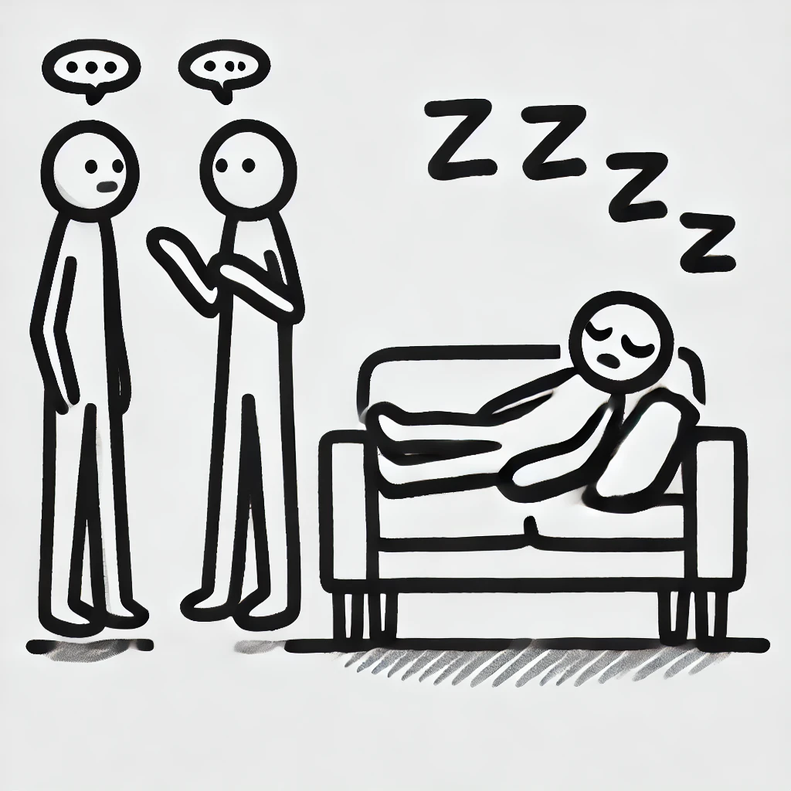

## Effect Oriented Programming

#### James Ward
*Developer Advocate @ AWS* <a href="https://twitter.com/_JamesWard?ref_src=twsrc%5Etfw" class="twitter-follow-button" data-size="large">@_JamesWard</a>

#### Bruce Eckel
*Author/Consultant* <a href="https://www.mindviewllc.com/">MindView LLC</a>

#### Bill Frasure
*Developer*

---

---

---

<pre style="font-size: 150px; text-align: center;">
f(g(h()))
</pre>

---

A sentence is composed of words.

---

  A&nbsp;sentence&nbsp;is&nbsp;composed&nbsp;of&nbsp;words.

---

## What are side effects?

- What challenges do they create?
- Why are they difficult to compose / chain / test?
- Signs of side-effects (e.g. Unit).

---

## Managing unpredicability with Effects & Effect Systems
